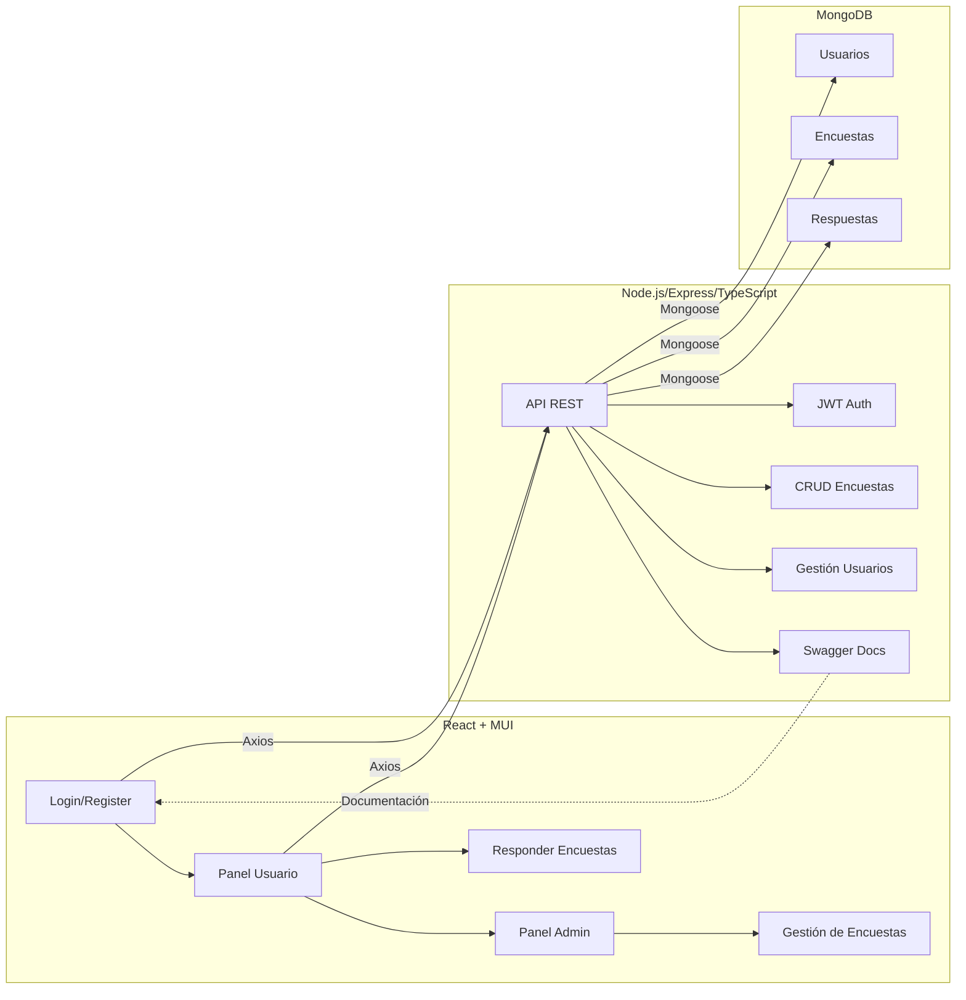
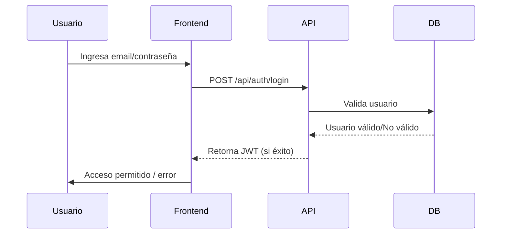
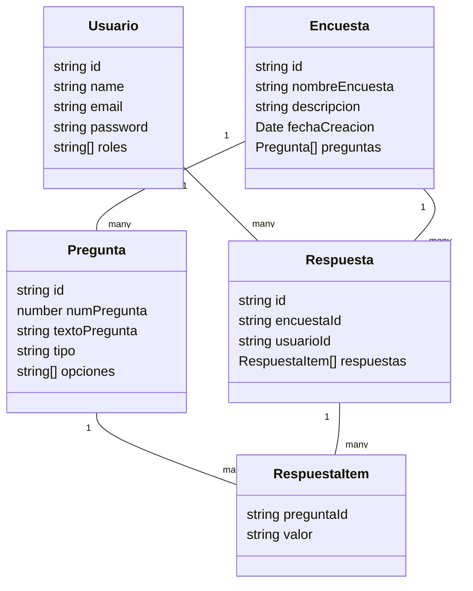
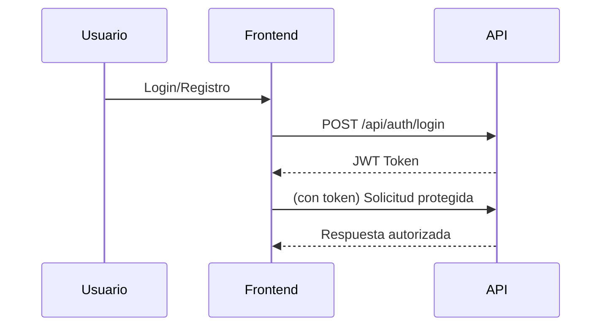

# Proyecto Final CRUD Full Stack – Sistema de Encuestas

> Aplicación full stack para la gestión de encuestas, con autenticación robusta basada en JWT, administración por roles, visualización de resultados, arquitectura profesional y documentación interactiva. Incluye backend Node.js/Express/TypeScript, frontend React/MUI y base de datos MongoDB.

---

## Tabla de Contenidos

- [Resumen Ejecutivo](#resumen-ejecutivo)
- [Motivación](#motivación)
- [Arquitectura General](#arquitectura-general)
- [Tecnologías y Estructura](#tecnologías-y-estructura)
- [Diagramas de Arquitectura y Flujos](#diagramas-de-arquitectura-y-flujos)
- [Instalación y Ejecución](#instalación-y-ejecución)
- [Configuración de Variables de Entorno](#configuración-de-variables-de-entorno)
- [Flujos de Uso: Usuario y Administrador](#flujos-de-uso-usuario-y-administrador)
- [Autenticación JWT y Seguridad](#autenticación-jwt-y-seguridad)
- [Endpoints Principales (API REST)](#endpoints-principales-api-rest)
- [Swagger: Documentación Interactiva](#swagger-documentación-interactiva)
- [Buenas Prácticas y Seguridad](#buenas-prácticas-y-seguridad)
- [Contribuir y Recursos](#contribuir-y-recursos)

---

## Resumen Ejecutivo

Sistema completo para crear, responder y administrar encuestas, pensado para ser fácilmente extendible y seguro. Implementa administración por roles, visualización de resultados y documentación interactiva con Swagger. Es ideal para organizaciones, investigación o cualquier contexto donde se requiera la gestión efectiva de encuestas.

---

## Motivación

El proyecto busca demostrar las mejores prácticas en arquitectura full stack moderna, integrando autenticación segura, una API robusta, un frontend amigable y una estructura escalable, útil para empresas, instituciones educativas o investigación.

---

## Arquitectura General



---

## Tecnologías y Estructura

### Backend

- **Lenguaje:** TypeScript
- **Framework:** Node.js + Express
- **Base de Datos:** MongoDB/Mongoose
- **Autenticación:** JWT (JSON Web Tokens)
- **Documentación:** Swagger
- **Estructura de Carpetas:** application, domain, infrastructure, presentation

### Frontend

- **Framework:** React
- **Routing:** React Router
- **UI:** Material-UI (MUI)
- **Gestión de estado:** Context API (autenticación)
- **Consumo API:** Axios

### Estructura de Carpetas

```
proyecto-final-crud-full-stack/
├── server/
│   └── src/
│       ├── application/
│       ├── domain/
│       ├── infrastructure/
│       ├── presentation/
├── frontend/
│   └── src/
│       ├── pages/
│       ├── components/
│       ├── context/
└── DIAGRAMAS.md
```

---

## Diagramas de Arquitectura y Flujos

### 1. Flujo de Autenticación



### 2. Modelo de Datos Simplificado



### 3. Flujo CRUD y Resultados

Ver [DIAGRAMAS.md](./DIAGRAMAS.md) para más diagramas de flujo, CRUD y flujos de resultados.

---

## Instalación y Ejecución

### 1. Clona el repositorio

```bash
git clone https://github.com/felipesanchez-dev/proyecto-final-crud-full-stack.git
cd proyecto-final-crud-full-stack
```

### 2. Instalación de dependencias

#### Backend
```bash
cd server
npm install
```

#### Frontend
```bash
cd ../frontend
npm install
```

---

## Configuración de Variables de Entorno

1. Crea un archivo `.env` en `server/` basado en `.env.template`.
2. Ejemplo de configuración:

```
PORT=3000
MONGO_URL=mongodb://localhost:27017
MONGO_DB_NAME=encuestas-db
JWT_SEED=ESTA-ES-MI-SEMILLA-SECRETA
```

---

## Flujos de Uso: Usuario y Administrador

### Usuario

1. Registrarse / Ingresar
2. Visualizar encuestas disponibles
3. Responder encuestas
4. Consultar resultados (si está habilitado)

### Administrador

1. Ingresar como admin
2. Crear, editar o eliminar encuestas y preguntas
3. Visualizar estadísticas y resultados agregados

---

## Autenticación JWT y Seguridad

El sistema utiliza **JSON Web Tokens (JWT)** para autenticar usuarios y proteger rutas sensibles.

- Al iniciar sesión o registrarse, el usuario recibe un token JWT.
- El token debe ser enviado en la cabecera `Authorization: Bearer <token>` en cada petición protegida.
- Los tokens tienen fecha de expiración y se pueden revalidar con el endpoint `/api/auth/revalidate-token`.
- Existen roles (`USER_ROLE`, `ADMIN_ROLE`) para limitar el acceso a ciertas funciones.

**Ejemplo de flujo de autenticación:**



---

## Endpoints Principales (API REST)

Consulta la [documentación Swagger](#swagger-documentación-interactiva) para detalles de cada endpoint y ejemplos de uso.

### Autenticación (`/api/auth`)

- `POST /login` – Inicia sesión y retorna un JWT.
- `POST /register` – Registra un nuevo usuario.
- `POST /admin-login` – Login exclusivo para administradores.
- `GET /revalidate-token` – Revalida un token de sesión.

### Encuestas (`/api/encuestas`)

- `GET /` – Lista todas las encuestas.
- `GET /:id` – Obtiene una encuesta específica.
- `POST /` – Crea una nueva encuesta.
- `PUT /:id` – Actualiza una encuesta.
- `DELETE /:id` – Elimina una encuesta.

### Preguntas (`/api/encuestas/:id/preguntas`)

- `POST /:id/preguntas` – Añade una pregunta.
- `PUT /:id/preguntas/:preguntaId` – Actualiza una pregunta.
- `DELETE /:id/preguntas/:preguntaId` – Elimina una pregunta.

### Respuestas y Resultados (`/api/encuestas/:id/...`)

- `POST /:id/responder` – Envía respuestas a una encuesta.
- `GET /:id/resultados` – Obtiene resultados agregados.

---

## Ejemplos de Uso de la API

### 1. Login de usuario

```json
POST /api/auth/login
{
  "email": "correo@ejemplo.com",
  "password": "tu-password"
}
```

### 2. Registro de usuario

```json
POST /api/auth/register
{
  "name": "Nombre Apellido",
  "email": "correo@ejemplo.com",
  "password": "tu-password"
}
```

### 3. Creación de encuesta

```json
POST /api/encuestas
{
  "nombreEncuesta": "Encuesta de Satisfacción",
  "descripcion": "Feedback sobre nuestros servicios"
}
```

### 4. Envío de respuestas

```json
POST /api/encuestas/:id/responder
{
  "usuarioId": "60d... (opcional si autenticado)",
  "respuestas": [
    {
      "preguntaId": "60d...",
      "valor": "Mucho"
    },
    {
      "preguntaId": "60d...",
      "valor": true
    }
  ]
}
```

---

## Swagger: Documentación Interactiva

La API está documentada y disponible en Swagger:

- **URL:** [http://localhost:3000/api-docs](http://localhost:3000/api-docs)

Desde Swagger puedes:
- Ver y probar todos los endpoints
- Consultar los esquemas de datos (DTOs)
- Probar rutas protegidas con autenticación JWT

---

## Buenas Prácticas y Seguridad

- Usa contraseñas robustas y mantén tu JWT en secreto.
- No expongas tus variables de entorno.
- Mantén actualizadas las dependencias.
- Cambia la semilla `JWT_SEED` antes de producción.
- Limita los permisos de los usuarios usando roles.
- Protege los endpoints sensibles y valida siempre la entrada de datos.
- Haz backups regulares de tu base de datos.

---

## Contribuir y Recursos

¿Quieres contribuir? ¡Bienvenido! Por favor:

1. Haz un fork y crea una rama.
2. Sigue las normas de código y documentación.
3. Abre un Pull Request describiendo tus cambios.

Recursos útiles:
- [Documentación oficial de React](https://react.dev/)
- [Node.js](https://nodejs.org/)
- [Express](https://expressjs.com/)
- [Mongoose](https://mongoosejs.com/)
- [Swagger](https://swagger.io/)

---

# API de Sistema de Encuestas

Esta es la documentación para el backend de la aplicación de encuestas, desarrollado con Node.js, Express, TypeScript y MongoDB. La API sigue una arquitectura limpia y proporciona endpoints para gestionar usuarios, encuestas, preguntas y respuestas.

## Características

-   **Autenticación de Usuarios**: Endpoints para registro e inicio de sesión con JSON Web Tokens (JWT).
-   **Gestión de Encuestas y Preguntas**: CRUD completo para encuestas y sus preguntas anidadas.
-   **Respuestas y Resultados**: Endpoints para que los usuarios respondan a encuestas y para consultar los resultados agregados.
-   **Seguridad**: Las rutas de autenticación están funcionales. Las rutas de encuestas/preguntas están actualmente desprotegidas para facilitar el desarrollo local.
-   **Documentación**: Documentación interactiva de la API con Swagger.

---

## Instalación y Ejecución

Sigue estos pasos para levantar el servidor en tu entorno local.

### 1. Clonar el Repositorio

```bash
git clone <URL_DEL_REPOSITORIO>
cd <NOMBRE_DEL_DIRECTORIO>
```

### 2. Instalar Dependencias

Asegúrate de tener [Node.js](https://nodejs.org/) instalado. Luego, instala las dependencias del proyecto.

```bash
npm install
```

### 3. Configurar Variables de Entorno

Crea un archivo `.env` en la raíz del proyecto. Puedes copiar el archivo `.env.template` como base:

```bash
cp .env.template .env
```

Abre el archivo `.env` y ajusta las variables según tu configuración:

```
# Puerto en el que correrá el servidor
PORT=3000

# URL de conexión a tu base de datos MongoDB
MONGO_URL=mongodb://localhost:27017

# Nombre de la base de datos (puedes usar tu apellido como pide el proyecto)
MONGO_DB_NAME=encuestas-db

# Semilla secreta para la firma de JSON Web Tokens
JWT_SEED=ESTA-ES-MI-SEMILLA-SECRETA
```

### 4. Ejecutar el Servidor

Para iniciar el servidor en modo de desarrollo (con recarga automática):

```bash
npm run dev
```

El servidor estará corriendo en la URL `http://localhost:3000`.

---

## Documentación Interactiva (Swagger)

Para una guía completa, interactiva y detallada de todos los endpoints, visita la documentación de Swagger una vez que el servidor esté en ejecución:

**URL de Swagger**: [http://localhost:3000/api-docs](http://localhost:3000/api-docs)

En la interfaz de Swagger podrás:
-   Ver todos los endpoints disponibles.
-   Probar cada endpoint directamente desde el navegador.
-   Ver los esquemas de datos (DTOs) para las peticiones y respuestas.
-   Para probar las rutas de autenticación, puedes usar el botón "Authorize".

---

## Guía de Endpoints

A continuación, un resumen de los endpoints disponibles.

### Autenticación (`/api/auth`)

#### `POST /login`
-   **Descripción**: Inicia sesión con un usuario existente.
-   **Cuerpo de la Petición (Campos requeridos)**:
    ```json
    {
      "email": "correo@ejemplo.com",
      "password": "tu-password"
    }
    ```

#### `POST /register`
-   **Descripción**: Registra un nuevo usuario.
-   **Cuerpo de la Petición (Campos requeridos)**:
    ```json
    {
      "name": "Nombre Apellido",
      "email": "correo@ejemplo.com",
      "password": "tu-password"
    }
    ```

#### `POST /admin-login`
-   **Descripción**: Inicia sesión como administrador. Falla si el usuario no tiene el rol `ADMIN_ROLE`.
-   **Cuerpo de la Petición (Campos requeridos)**:
    ```json
    {
      "email": "admin@ejemplo.com",
      "password": "tu-password-admin"
    }
    ```

#### `GET /revalidate-token`
-   **Descripción**: Revalida un token de sesión existente. Requiere enviar el token actual en la cabecera `Authorization` como `Bearer <token>`.
-   **Respuesta Exitosa (200)**: Devuelve los datos del usuario y un nuevo token con la fecha de expiración renovada.
    ```json
    {
      "user": { "id": "...", "name": "...", "email": "...", "roles": ["..."] },
      "token": "ey... (nuevo token)"
    }
    ```

### Encuestas (`/api/encuestas`)

#### `GET /`
-   **Descripción**: Obtiene una lista de todas las encuestas.

#### `GET /:id`
-   **Descripción**: Obtiene una encuesta específica por su ID.

#### `POST /`
-   **Descripción**: Crea una nueva encuesta.
-   **Cuerpo de la Petición (Campos requeridos)**:
    ```json
    {
      "nombreEncuesta": "Encuesta de Satisfacción",
      "descripcion": "Feedback sobre nuestros servicios"
    }
    ```

#### `PUT /:id`
-   **Descripción**: Actualiza el nombre o la descripción de una encuesta.

#### `DELETE /:id`
-   **Descripción**: Elimina una encuesta por su ID.

### Preguntas (`/api/encuestas/:id/preguntas`)

#### `POST /:id/preguntas`
-   **Descripción**: Añade una nueva pregunta a una encuesta existente.
-   **Cuerpo de la Petición (Campos requeridos)**:
    ```json
    {
      "numPregunta": 1,
      "textoPregunta": "¿Qué tan satisfecho estás?",
      "tipo": "opcion", // "texto", "opcion", o "boolean"
      "opciones": ["Mucho", "Poco", "Nada"] // Requerido si tipo es "opcion"
    }
    ```

#### `PUT /:id/preguntas/:preguntaId`
-   **Descripción**: Actualiza una pregunta existente dentro de una encuesta.

#### `DELETE /:id/preguntas/:preguntaId`
-   **Descripción**: Elimina una pregunta de una encuesta.

### Respuestas y Resultados (`/api/encuestas/:id/...`)

#### `POST /:id/responder`
-   **Descripción**: Envía un conjunto de respuestas para una encuesta específica.
-   **Cuerpo de la Petición (Campos requeridos)**:
    ```json
    {
      "usuarioId": "60d... (Opcional)",
      "respuestas": [
        {
          "preguntaId": "60d... (ID de la pregunta)",
          "valor": "Mucho"
        },
        {
          "preguntaId": "60d... (ID de otra pregunta)",
          "valor": true
        }
      ]
    }
    ```

#### `GET /:id/resultados`
-   **Descripción**: Obtiene los resultados agregados para una encuesta.
-   **Respuesta Exitosa (200)**:
    ```json
    {
      "encuesta": {
        "id": "...",
        "nombreEncuesta": "Encuesta de Satisfacción",
        "descripcion": "..."
      },
      "resumen": [
        {
          "preguntaId": "...",
          "textoPregunta": "¿Qué tan satisfecho estás?",
          "tipo": "opcion",
          "resultados": [
            { "valor": "Mucho", "conteo": 15 },
            { "valor": "Poco", "conteo": 5 }
          ]
        }
      ]
    }
    ```

