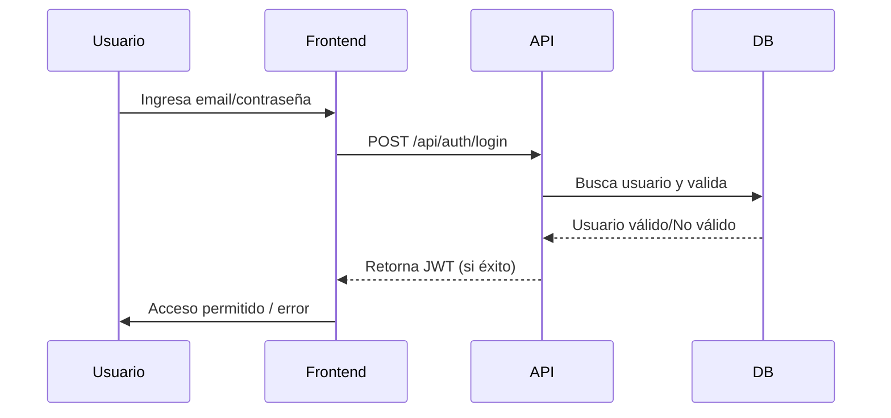
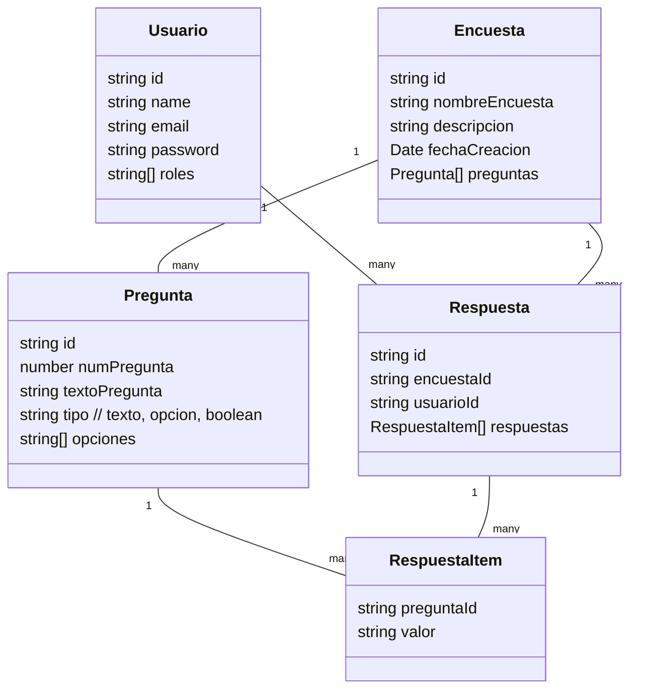
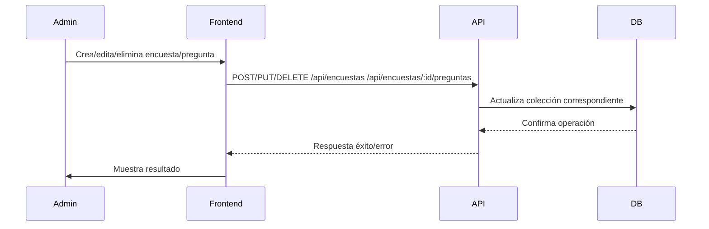
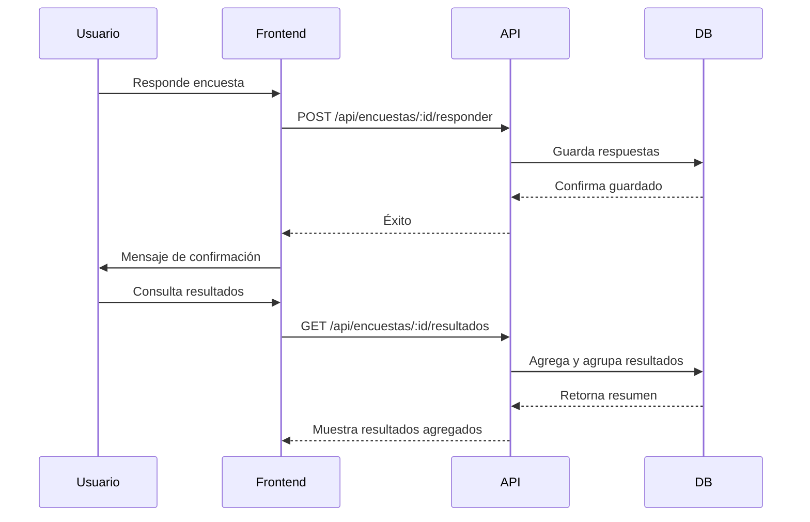

# Proyecto Final CRUD Full Stack – Sistema de Encuestas

Este proyecto es una aplicación full stack para la gestión de encuestas con autenticación de usuarios, administración, y visualización de resultados. Incluye backend en Node.js/Express/TypeScript y frontend en React, junto con una API REST documentada con Swagger.

---

## Tabla de Contenidos
- [Descripción General](#descripción-general)
- [Arquitectura y Tecnologías](#arquitectura-y-tecnologías)
- [Instalación y Ejecución](#instalación-y-ejecución)
- [Endpoints Principales](#endpoints-principales)
- [Diagramas y Flujo de la Aplicación](./DIAGRAMAS.md)
- [Swagger: Documentación Interactiva](#swagger-documentación-interactiva)

---

## Descripción General

Esta aplicación permite a usuarios autenticarse, gestionar (crear, leer, actualizar y eliminar) encuestas y preguntas, responder encuestas y consultar resultados agregados. Está diseñada siguiendo buenas prácticas de arquitectura limpia y separación de responsabilidades, facilitando el desarrollo, mantenimiento y pruebas.

---

## Arquitectura y Tecnologías

### Backend
- **Lenguaje:** TypeScript
- **Framework:** Node.js + Express
- **Base de Datos:** MongoDB/Mongoose
- **Autenticación:** JWT (JSON Web Tokens)
- **Documentación:** Swagger
- **Principales módulos:** 
  - Rutas de autenticación y gestión de usuarios
  - CRUD de encuestas y preguntas anidadas
  - Respuestas de usuarios y agregación de resultados

### Frontend
- **Framework:** React
- **Routing:** React Router
- **Gestión de estado:** Context API para autenticación
- **UI:** Material-UI (MUI)
- **Consumo API:** Axios

---

## Instalación y Ejecución

### 1. Clonar el Repositorio

```bash
git clone https://github.com/felipesanchez-dev/proyecto-final-crud-full-stack.git
cd proyecto-final-crud-full-stack
```

### 2. Instalar Dependencias

#### Backend
```bash
cd server
npm install
```

#### Frontend
```bash
cd ../frontend
npm install
```

### 3. Configurar Variables de Entorno

Configura los archivos `.env` para el backend y frontend según corresponda (ver ejemplos en cada carpeta).

### 4. Ejecutar el Servidor

#### Backend
```bash
cd server
npm run dev
# Servidor disponible en http://localhost:3000
```

#### Frontend
```bash
cd frontend
npm start
# Aplicación React en http://localhost:3001
```

---

## Endpoints Principales

La API REST provee endpoints para autenticación, gestión de encuestas, preguntas y respuestas.

### Autenticación (`/api/auth`)

- `POST /login` – Iniciar sesión de usuario.
- `POST /register` – Registrar un nuevo usuario.
- `POST /admin-login` – Login de administrador (requiere rol `ADMIN_ROLE`).
- `GET /revalidate-token` – Revalida el token y renueva sesión.

### Encuestas (`/api/encuestas`)

- `GET /` – Listar todas las encuestas.
- `GET /:id` – Obtener encuesta por ID.
- `POST /` – Crear una nueva encuesta.
- `PUT /:id` – Actualizar encuesta.
- `DELETE /:id` – Eliminar encuesta.

### Preguntas (`/api/encuestas/:id/preguntas`)

- `POST /:id/preguntas` – Añadir nueva pregunta a encuesta.
- `PUT /:id/preguntas/:preguntaId` – Actualizar pregunta.
- `DELETE /:id/preguntas/:preguntaId` – Eliminar pregunta.

### Respuestas y Resultados (`/api/encuestas/:id/...`)

- `POST /:id/responder` – Enviar respuestas a una encuesta.
- `GET /:id/resultados` – Obtener resultados agregados de una encuesta.

Consulta la documentación Swagger para detalles de cada endpoint y sus esquemas de datos.

---

## Swagger: Documentación Interactiva

La API está documentada y disponible en Swagger:

- **URL:** [http://localhost:3000/api-docs](http://localhost:3000/api-docs)

En la interfaz de Swagger puedes:
- Ver todos los endpoints disponibles
- Probar endpoints desde el navegador
- Consultar los esquemas de datos (DTOs)
- Usar "Authorize" para probar rutas protegidas

---

## Diagramas

Consulta el archivo [`DIAGRAMAS.md`](./DIAGRAMAS.md) para ver diagramas de arquitectura, flujo y esquemas de datos.

---
# Diagramas de Arquitectura y Flujos

A continuación se presentan diagramas y descripciones visuales para comprender la estructura y el flujo de la aplicación.

---


## 2. Flujo de Autenticación



---

## 3. Modelo de Datos Simplificado



---

## 4. Flujo CRUD de Encuestas y Preguntas



---

## 5. Flujo de Respuestas y Resultados



---

## 6. Estructura de Carpetas (Resumen)

```
proyecto-final-crud-full-stack/
├── server/
│   ├── src/
│   │   ├── application/
│   │   ├── domain/
│   │   ├── infrastructure/
│   │   ├── presentation/
│   │   └── ...
│   └── README.md
├── frontend/
│   ├── src/
│   │   ├── pages/
│   │   ├── components/
│   │   ├── context/
│   │   └── ...
│   └── README.md
└── DIAGRAMAS.md
```

---

Estos diagramas ayudan a visualizar la estructura, modelos y flujos más importantes de la aplicación. Para detalles sobre endpoints y ejemplos de uso consulta el archivo README principal y la documentación Swagger.